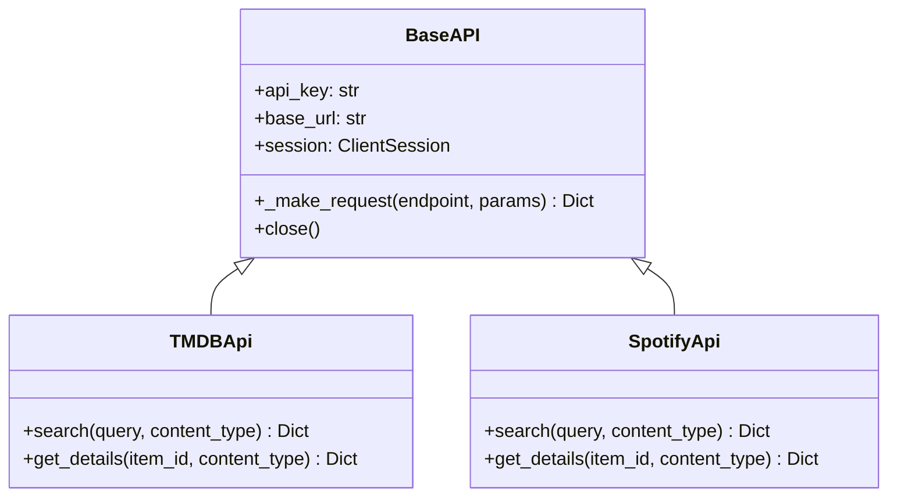

# APIs Module

The `sok.apis` module contains all external service integrations.

## Overview

All APIs inherit from `BaseAPI` which provides common HTTP client functionality
with `aiohttp`.

## Supported Services

### Video

| Service | Class | Features |
| --------- | ------- | ---------- |
| TMDB | `TMDBApi` | Movies, TV series, episodes |
| TVDB | `TVDBApi` | TV series, episodes |
| IMDB | `IMDBApi` | Movies, ratings |

### Music

| Service | Class | Features |
| --------- | ------- | ---------- |
| Spotify | `SpotifyApi` | Albums, tracks, artists |
| Last.fm | `LastFMApi` | Scrobbling, recommendations |
| Deezer | `DeezerApi` | Albums, tracks |
| MusicBrainz | `MusicBrainzApi` | Metadata |

### Books

| Service | Class | Features |
| --------- | ------- | ---------- |
| Google Books | `GoogleBooksApi` | Books, ebooks |
| OpenLibrary | `OpenLibraryApi` | Books, metadata |

### Games

| Service | Class | Features |
| --------- | ------- | ---------- |
| IGDB | `IGDBApi` | Games, DLCs |
| RAWG | `RAWGApi` | Games, ratings |

## Submodules

- [Base API](base_api.md) - Common HTTP client
- [Video APIs](video.md) - TMDB, TVDB, IMDB
- [Music APIs](music.md) - Spotify, Last.fm, Deezer, MusicBrainz
- [Books APIs](books.md) - Google Books, OpenLibrary
- [Games APIs](games.md) - IGDB, RAWG
