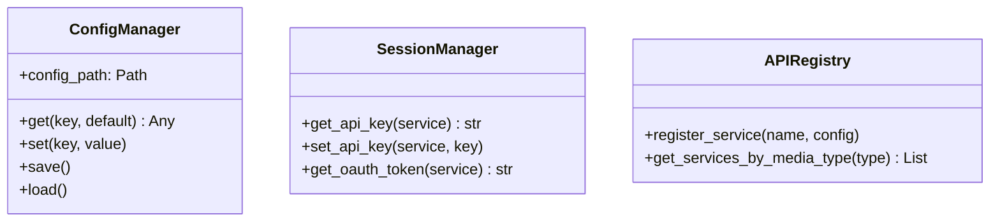

# Configuration Module

The `sok.config` module handles all configuration, settings, and session management.

## Overview

Configuration is split into three main components:

- **Config Manager**: Application settings and preferences
- **Session Manager**: API keys, OAuth tokens, and credentials
- **API Registry**: Service discovery and configuration

## Submodules

- [Config Manager](config_manager.md) - Application settings
- [Session Manager](session_manager.md) - API keys and tokens
- [API Registry](api_registry.md) - Service discovery
