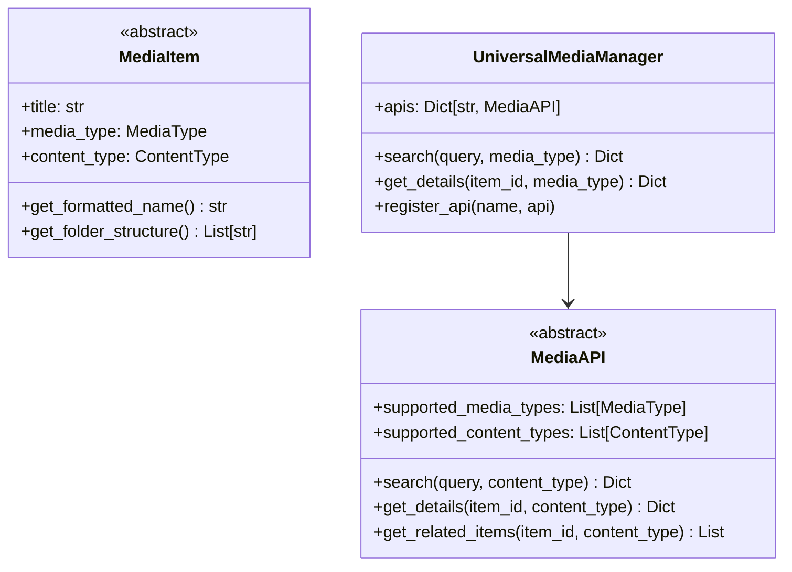

# Core Module

The `sok.core` module contains the fundamental interfaces, managers, and utilities
that form the backbone of S.O.K.

## Overview

## Submodules

- [Interfaces](interfaces.md) - Abstract base classes
- [Media Manager](media_manager.md) - Central orchestrator
- [Exceptions](exceptions.md) - Error handling
- [Utils](utils.md) - Utility functions
