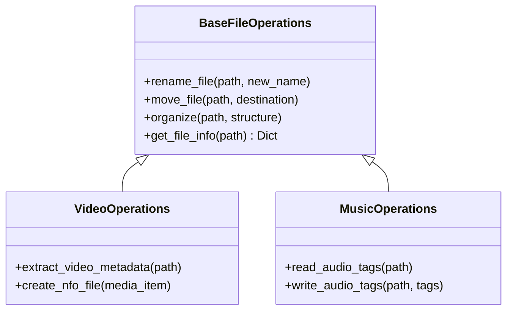

# File Operations Module

The `sok.file_operations` module handles all file system interactions for
organizing, renaming, and managing media files.

## Overview

File operations are organized by media type, each inheriting from a common base
class.

## Submodules

- [Base Operations](base_operations.md) - Common file operations
- [Video Operations](video_operations.md) - Video file handling
- [Music Operations](music_operations.md) - Audio file handling
- [Book Operations](book_operations.md) - Book/PDF handling
- [Game Operations](game_operations.md) - Game file handling
