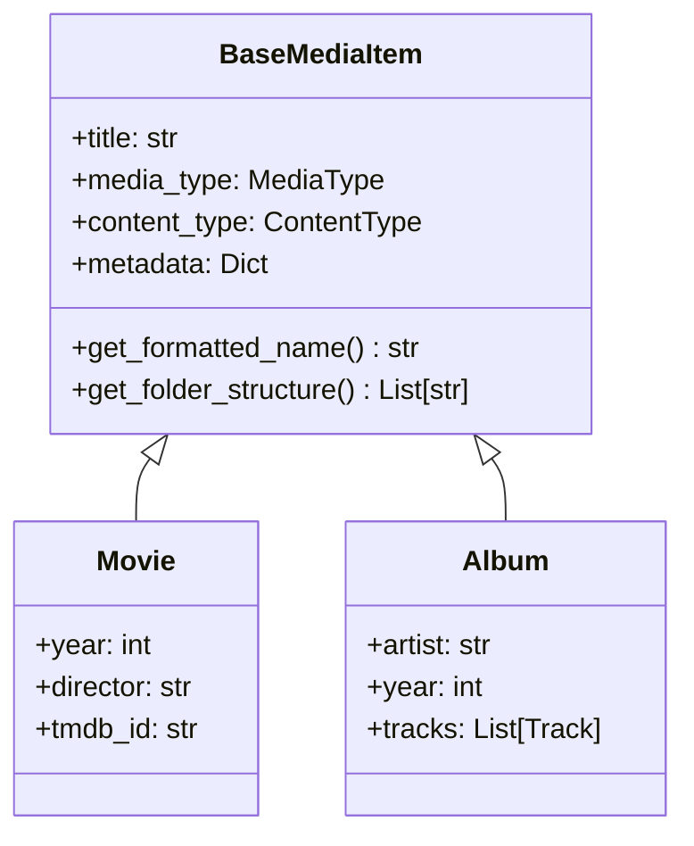

# Media Module

The `sok.media` module contains data models representing different types of media
items.

## Overview

All media items inherit from a common base class that provides:

- Standard attributes (title, metadata, IDs)
- Formatted naming for files
- Folder structure generation

## Submodules

- [Base Media](base_media.md) - Common media attributes
- [Video](video.md) - Movie, TVSeries, Episode
- [Music](music.md) - Album, Track, Artist
- [Books](books.md) - Book, Ebook, Audiobook
- [Games](games.md) - Game, DLC
