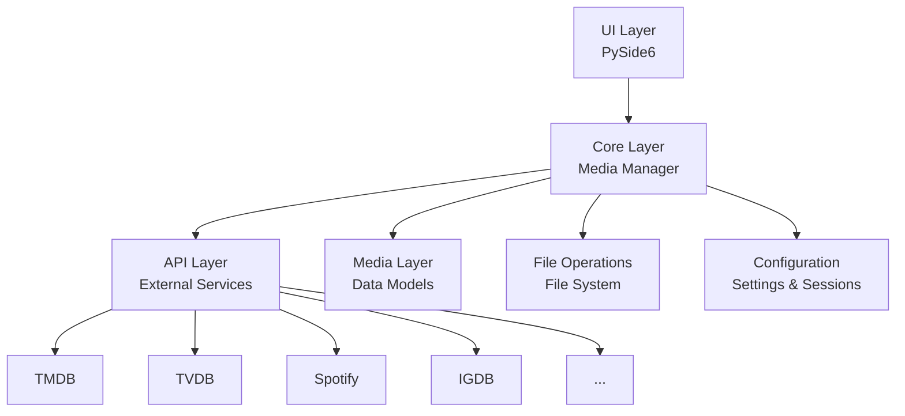
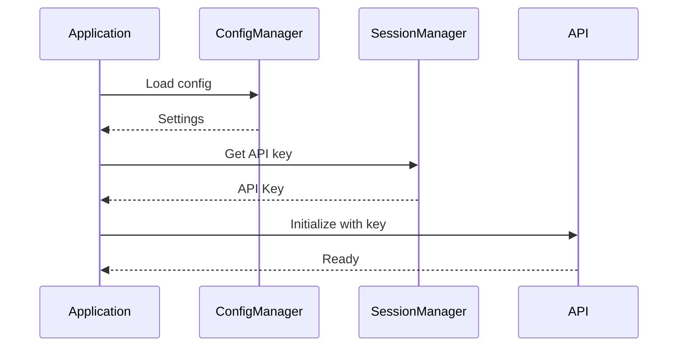

# Architecture Overview

S.O.K follows a clean, modular architecture with clear separation of concerns.

## High-Level Architecture



## Layer Responsibilities

### UI Layer (`sok.ui`)

The user interface layer built with PySide6:

- **Main Window**: Application shell and navigation
- **Pages**: Different views (library, search, settings)
- **Components**: Reusable UI components
- **Workers**: Background tasks using Qt threads

### Core Layer (`sok.core`)

The business logic layer:

- **Media Manager**: Orchestrates all media operations
- **Interfaces**: Abstract base classes defining contracts
- **Exceptions**: Custom exception hierarchy
- **Utils**: Shared utility functions

### API Layer (`sok.apis`)

External service integrations:

- **Base API**: Common HTTP client functionality
- **Video APIs**: TMDB, TVDB, IMDB
- **Music APIs**: Spotify, Last.fm, Deezer, MusicBrainz
- **Book APIs**: Google Books, OpenLibrary
- **Game APIs**: IGDB, RAWG

### Media Layer (`sok.media`)

Data models representing media items:

- **Base Media**: Common media attributes
- **Specialized Media**: Video, Music, Book, Game classes

### File Operations (`sok.file_operations`)

File system interactions:

- **Base Operations**: Common file operations
- **Specialized Operations**: Media-specific file handling

### Configuration (`sok.config`)

Settings and session management:

- **Config Manager**: Application settings
- **Session Manager**: API keys and OAuth tokens
- **API Registry**: Service discovery and configuration

## Design Patterns

### Singleton Pattern

The `UniversalMediaManager` uses a singleton pattern:

```python
from sok.core.media_manager import get_media_manager

# Always returns the same instance
manager = get_media_manager()
```

### Abstract Factory Pattern

Media items are created through factory methods:

```python
# APIs return standardized data structures
results = await api.search("query", content_type)
```

### Strategy Pattern

Different APIs can be swapped for the same media type:

```python
# Configure which API to use for video
manager.set_api(MediaType.VIDEO, "tmdb")
```

### Adapter Pattern

API responses are normalized through adapters:

```python
from sok.core.adapters.media_adapters import adapt_search_results

normalized = adapt_search_results(raw_response, api_name)
```

## Async Architecture

S.O.K uses `asyncio` and `aiohttp` for efficient API communication:

```python
async def search_multiple_apis():
    # Concurrent API calls
    results = await asyncio.gather(
        api1.search(query),
        api2.search(query),
        api3.search(query)
    )
    return results
```

## Error Handling

Custom exception hierarchy in `sok.core.exceptions`:

```
APIError
├── APINotFoundError
├── APIConnectionError
├── APITimeoutError
└── APIResponseError

MediaError
├── UnsupportedMediaTypeError
└── InvalidMediaError
```

## Configuration Flow


